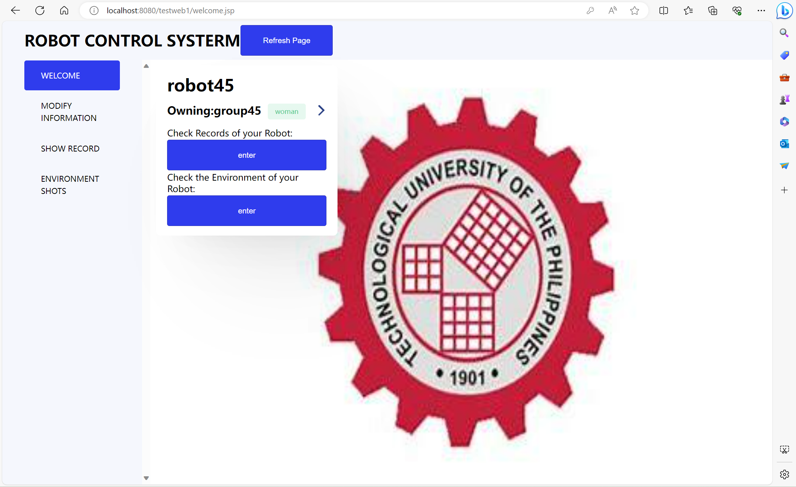

# E-Commerce
## Table of Contents
- [E-commerce](#e-commerce)
  - [Project Introduction and Basic Functions](#project-introduction-and-basic-functions)
  - [Method for running code: Installation, Operating method](#method-for-running-code-installation-operating-method)
  - [Instructions for use](#instructions-for-use)
  - [Developer](#developer)
## Project Introduction and Basic Functions
The project is a Java web application that appears to be related to user registration, login, deletion and management of user information and robot information.The application uses Servlets, jsp ,css and communicates with a database through DAO (Data Access Object) classes.

## Method for running code: Installation, Operating method
* Installation:Eclipse java version 17.0.6+ Tomcat v8.5+ Mysql 8.0.32+
* Operating method:open eclipse, Import Code and click "run on server"
## Instructions for use
* The website will be opened on the host, and then register and log in to the welcome page.

* And click the arrow mark ,there are some basic functions including updating username, password, robotname, address uploading pictures,deleting users. 

* And click the first enter there is a updating function, updating address which contains the pictures the vehicle recorded. Then there is a form of information and pictures displayed below

## Developer
* Yin Ru Nan
* Wang Zi Shuo
