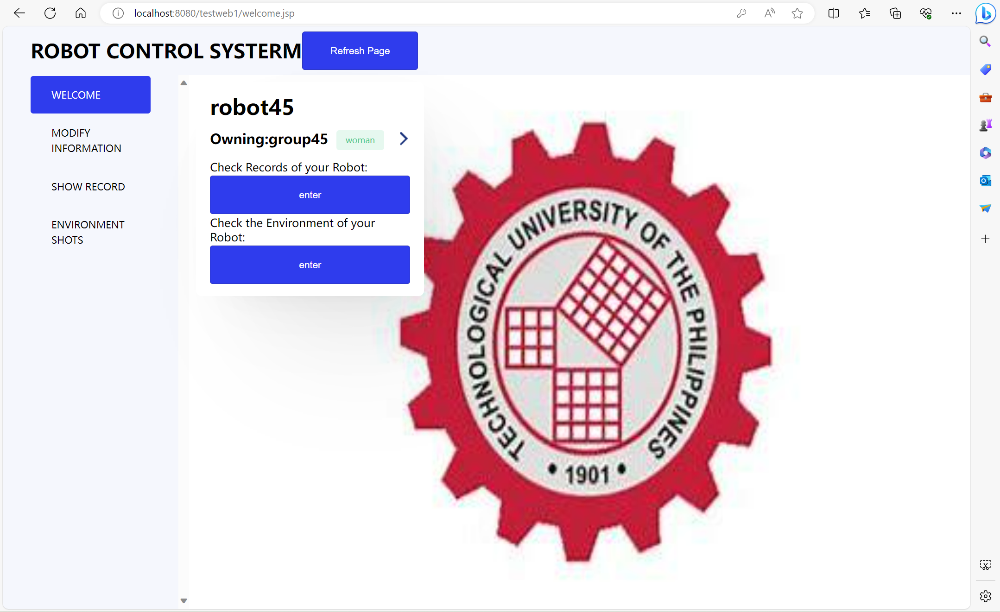
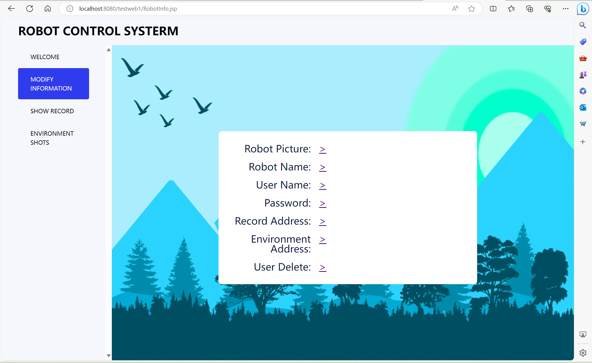
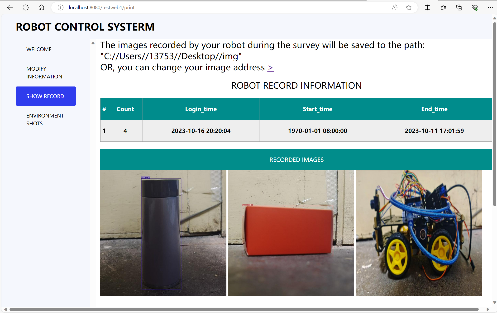
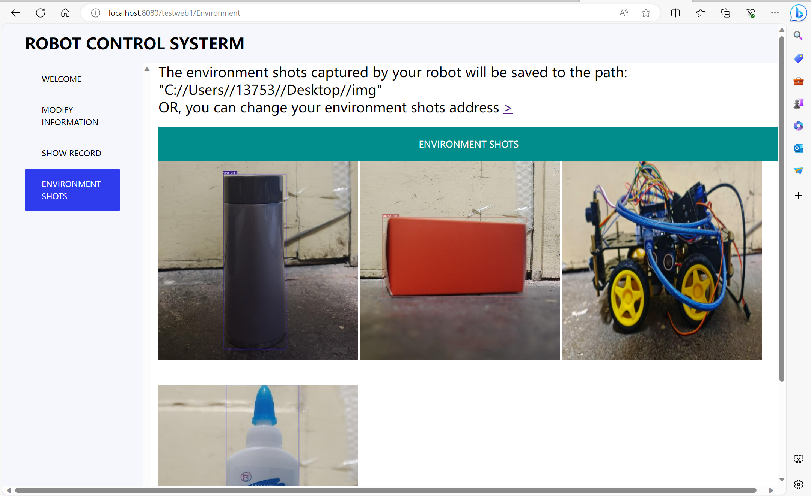

# Design and Build -- Group45


- [Telecom](#telecom)
- [Intelligent Photo-Recognition Obstacle-Avoidance Car](#intelligent-photo-recognition-obstacle-avoidance-car)
  - [Introduction](#introduction)
  - [Features](#features)
  - [Components](#components)
  - [Requirements](#requirements)
  - [User Scenarios](#user-scenarios)
  - [Specific Functions](#specific-functions)
  - [Code Overview](#code-overview)
  - [Getting Started](#getting-started)
    - [Prerequisites](#prerequisites)
  - [Usage](#usage)
- [Internet of Things](#internet-of-things)
  - [Table of Contents](#table-of-contents)
  - [General Info](#general-info)
  - [Technologies](#technologies)
  - [Setup](#setup)
  - [Features](#features)
    - [1. Object Detection in Images](#1-object-detection-in-images)
    - [2. Real-time Object Detection](#2-real-time-object-detection)
    - [3. Image Comparison GUI](#3-image-comparison-gui)
    - [4. Video Frame Capture](#4-video-frame-capture)
  - [Status](#status)
  - [Inspiration](#inspiration)
  - [Contact](#contact)
- [E-commerce](#e-commerce)
  - [Project Introduction and Basic Functions](#project-introduction-and-basic-functions)
  - [Method for running code: Installation, Operating method](#method-for-running-code-installation-operating-method)
  - [Instructions for use](#instructions-for-use)
  - [Developer](#developer)

# Telecom
# Intelligent Photo-Recognition Obstacle-Avoidance Car

## Introduction

The Intelligent Photo-Recognition Obstacle-Avoidance Car is an innovative robot built upon the Arduino platform. This smart vehicle is not just capable of autonomous navigation and obstacle avoidance through sensor detection but also features treasure recognition through photo recognition algorithms. Compact, highly operational, and user-friendly, this car is perfect for applications in tech education and smart home setups.

## Features

- Autonomous navigation and obstacle avoidance
- Treasure recognition through photo capturing and E-commerce\readme\readme\Image\ recognition
- Stable and reliable sensor-to-board connections
- Quick response time (less than 1 second)
- User-friendly operation

## Components

- 1x Arduino control board
- 1x Ultrasonic sensor
- 2x Infrared sensors
- 1x Camera
- 1x DC motor drive module
- 4x DC motors
- 8x Copper columns
- Several Dupont wires
- 1x Battery box
- 1x Aluminum chassis

## Requirements

- **Obstacle Avoidance**: The car should detect obstacles in its path and navigate accordingly based on the obstacle's distance.
- **Photo Recognition**: The car should capture photos using its camera and identify "treasures" through an E-commerce\readme\readme\Image\ recognition algorithm.
- **Connection Stability**: Ensure stable and reliable connections among sensors, camera, and the Arduino control board, with accurate data transmission.
- **Response Speed**: Sensor detection and obstacle avoidance should have a response time of less than 1 second.
- **Ease of Operation**: The car should feature a simple and intuitive user interface for easy operation and control.

## User Scenarios

- **Educational**: Can be employed in educational scenarios, especially for teaching and learning about intelligent robots, enhancing students' understanding and interest in technology.
- **DIY Hobbyists**: Ideal for enthusiasts who enjoy electronic DIY and programming, allowing them to assemble and program robots using the provided components.
- **Home Entertainment**: Serves as an interactive home entertainment robot, enhancing family interactions and leisure activities.

## Specific Functions

- **Obstacle Avoidance**: Utilizes ultrasonic and infrared sensors to detect obstacles, choosing appropriate avoidance maneuvers based on the data received.
- **Photo Recognition**: Employs a camera to capture E-commerce\readme\readme\Image\s and utilizes E-commerce\readme\readme\Image\ recognition algorithms to identify specific objects or "treasures."

## Code Overview

The provided Arduino script (`main.ino`) controls the car's movement logic. It continuously reads from the ultrasonic sensors and controls the motors based on these readings, allowing the car to move autonomously while avoiding obstacles.

```
cppCopy code// Pin definitions, variable declarations, and initial setup...

void loop() {
  // Retrieve distance measurements from sensors
  long distanceFront = getDistance(trigPin1, echoPin1);
  // ... other distance measurements

  // Print distances to the serial monitor for debugging
  Serial.print("Front Distance: ");
  // ... other print statements

  // Car movement logic based on sensor readings
  // ... includes forward, backward, turnRight, turnLeft, stop functions

  // Obstacle avoidance logic
  // ... conditions and movement commands based on sensor data
}

// Function to calculate the distance based on sensor readings
long getDistance(int trigPin, int echoPin) {
  // ... code to calculate distance
}
```

## Getting Started

These instructions will get you a copy of the project up and running on your local machine for development and testing purposes.

### Prerequisites

- Arduino IDE or compatible software
- Complete set of specified components
- Access to a power source (for the battery box)
- Basic knowledge of electronics assembly


## Usage

1. Power on the car by connecting the battery box.
2. Place the car in the start position in your test area or maze.
3. Monitor the car's movements; it should navigate autonomously, avoiding obstacles, and capturing photos of identified "treasures."

# Internet of Things

This project focuses on object detection and E-commerce\readme\readme\Image\ processing and  is used for the DB project of IoT Engineering in the junior year of 2021 at the International College of Beijing University of Posts and Telecommunications (BUPT). It utilizes a pre-trained YOLOv8 model for object detection in E-commerce\readme\readme\Image\s and real-time video streams.

## General Info

The main goal of this project is to facilitate object detection in various contexts. It can be used for detecting objects in still E-commerce\readme\readme\Image\s, real-time video streams, and for comparing E-commerce\readme\readme\Image\s side-by-side through a graphical user interface. The three types of objects that can be detected are books, Rubik's Cubes and keys. The training data includes E-commerce\readme\readme\Image\s captured in various environments to demonstrate the accuracy of our algorithm.

## Technologies

Project is created with:
* Python 3.x
* ultralytics
* opencv-python
* torch
* PIL
* tkinter

## Setup

To run this project, install it locally using git:
```
$ git clone https://github.com/Skialith/Design_and_Build.git
$ cd Design_and_Build
```
## Features

List of features ready and TODOs for future development

### 1. Object Detection in E-commerce\readme\readme\Image\s

* **Script**: `test_model.py`
* **Description**: This script performs object detection on E-commerce\readme\readme\Image\s using a pre-trained YOLOv8 model. Detected objects are filtered based on confidence thresholds and specific categories.
* **Usage**: 
  ```sh
  python test_model.py
  ```
* **Note**: Make sure the dependency library 'ultralytics' is installed. You need to specify the path to the weights file for the pre-trained model.

### 2. Real-time Object Detection

* **Script**: `final_demo.py`
* **Description**: This script is used for real-time object detection in video streams. It captures video frames, performs object detection, and saves E-commerce\readme\readme\Image\s with detection labels. Also save the start and end times.
* **Usage**: 
  ```sh
  python final_demo.py
  ```
* **Note**: Make sure that the dependency libraries 'ultralytics', 'opencv-python', and 'torch' are installed.

### 3. E-commerce\readme\readme\Image\ Comparison GUI

* **Script**: `pic_comparison.py`
* **Description**: The script provides a graphical user interface for side-by-side comparisons showing the E-commerce\readme\readme\Image\s before and after the detection was performed.
* **Usage**: 
  ```sh
  python pic_comparison.py
  ```
* **Note**: Make sure that the dependency libraries 'PIL' and 'tkinter' are installed.

### 4. Video Frame Capture

* **Script**: `extraction_of_frame.py`
* **Description**: This script captures video frames and saves them as E-commerce\readme\readme\Image\s to help the Telecom team record photos of the environment during their explorations
* **Usage**: 
  ```sh
  python extraction_of_frame.py

* **Note**: Make sure the dependency library 'opencv-python' is installed.

## Status

Project is: _in progress_

## Inspiration

The genesis of this project lies in the ever-growing necessity for intelligent, real-time environmental monitoring systems. In an era where data is power, the ability to not just capture but also interpret visual data through object detection offers immense possibilities. This project harnesses the power of YOLOv8, a state-of-the-art machine learning model, to turn ordinary camera footage into a rich source of insights.

Primary applications include:
- **Environmental Monitoring**: Automated procedures for checking objects and recording environments are essential for areas of a project that require constant monitoring or event detection.
- **Model Demonstration**: A tangible way to showcase the capabilities of object detection models, providing a bridge between theory and practice.

Envisioning the future, the potential expansions could be:
- **Smart Urban Planning**: Analyzing foot traffic, vehicle movement, or environmental changes in real-time, contributing to more informed urban development decisions.
- **Enhanced Security Systems**: Integration into security systems for more nuanced detection, including unauthorized activities or unattended objects.
- **Wildlife Observation**: Non-intrusive monitoring of natural habitats, aiding in wildlife protection and research without human interference.
- **Disaster Response**: Quick analysis of environments in disaster-stricken areas, assisting in efficient and effective response plans.

This project is not just a testament to technological advancement but a step towards smarter, data-driven decision-making processes in various fields. The adaptability of the system promises continual evolution alongside future advancements in machine learning and data analysis.


## Contact

Created by [@Skialith](https://github.com/Skialith) - feel free to contact me!

# E-commerce
## Project Introduction and Basic Functions
The project is a Java web application that appears to be related to user registration, login, deletion and management of user information and robot information.The application uses Servlets, jsp ,css and communicates with a database through DAO (Data Access Object) classes.

## Method for running code: Installation, Operating method
* Installation:Eclipse java version 17.0.6+ Tomcat v8.5+ Mysql 8.0.32+
* Operating method:open eclipse, Import Code and click "run on server"
## Instructions for use
* The website will be opened on the host, and then register and log in to the welcome page.

* And click the arrow mark ,there are some basic functions including updating username, password, robotname, address uploading pictures,deleting users. 

* And click the first enter there is a updating function, updating address which contains the pictures the vehicle recorded. Then there is a form of information and pictures displayed below

## Developer
* Yin Ru Nan
* Wang Zi Shuo
